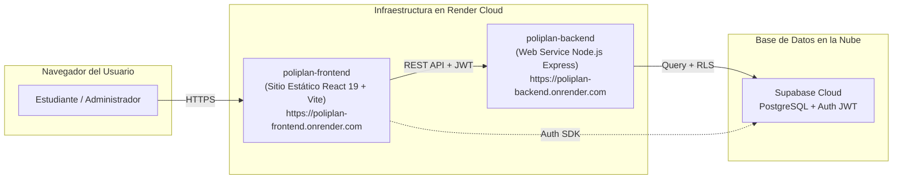

# Guía Oficial de Despliegue en Render (PoliPlan)

* **Proyecto:** PoliPlan — Sistema Integral de Planificación y Gestión Académica
* **Objetivo:** Publicación del sistema en un entorno web público (Punto 1 del encargo)
* **Fecha Límite de Entrega:** 26 de Septiembre de 2026 — 12:00 PM
* **Infraestructura:** Render Cloud (Blueprint Infrastructure as Code)

---

## 1. Arquitectura de Despliegue en la Nube

El repositorio cuenta con el archivo de infraestructura como código [`render.yaml`](file:///c:/Users/sebas/OneDrive/Desktop/ProyectoDeSW/render.yaml) en la raíz, que orquesta automáticamente los dos servicios necesarios:



---

## 2. Paso a Paso para Activar el Despliegue (3 Pasos)

### Paso 1: Subir cambios a GitHub
Asegurarse de que el repositorio en GitHub contenga los últimos cambios:
```bash
git add .
git commit -m "feat: configuracion lista para despliegue y paquete de pruebas funcionales"
git push origin main
```

### Paso 2: Crear el Blueprint en Render
1. Iniciar sesión en [dashboard.render.com](https://dashboard.render.com).
2. Hacer clic en el botón superior **"New +"** y seleccionar **"Blueprint"**.
3. Conectar y seleccionar el repositorio del proyecto en GitHub (`ProyectoDeSW` o el nombre asignado en su organización).
4. Render detectará automáticamente el archivo `render.yaml` y configurará:
   * **`poliplan-backend`:** Servicio Web (Node.js runtime, puerto 3000).
   * **`poliplan-frontend`:** Sitio Estático (Vite build a `dist/`).

### Paso 3: Configurar Variables de Entorno en el Dashboard
En la pantalla de confirmación de Render o en la pestaña **Environment** de cada servicio, ingresar los valores de conexión de Supabase:

#### En `poliplan-backend`:
* `PORT`: `3000` *(configurado por defecto)*
* `SUPABASE_URL`: Su URL de proyecto de Supabase (ej: `https://xyzcompany.supabase.co`)
* `SUPABASE_KEY`: La clave `service_role` o `anon` de su proyecto Supabase.
* `CLIENT_URL`: Se enlaza automáticamente al host del frontend.

#### En `poliplan-frontend`:
* `VITE_APP_SUPABASE_URL`: Su URL de proyecto Supabase.
* `VITE_APP_SUPABASE_ANON_KEY`: Su clave anónima (`anon key`) pública de Supabase.
* `VITE_API_BASE_URL`: Se enlaza automáticamente al host del backend.

Hacer clic en **"Apply"**. Render compilará ambos servicios y en aproximadamente 2 a 3 minutos estarán en línea con certificados SSL gratuitos (`https://`).

---

## 3. URLs Públicas de Entrega

Una vez finalizado el build en Render, las URLs generadas tendrán la siguiente estructura para reportar en la entrega oficial:

* **URL de la Aplicación Web (Frontend):** `https://poliplan-frontend.onrender.com` (o la URL personalizada que asigne Render).
* **URL de la API REST (Backend):** `https://poliplan-backend.onrender.com`
* **Endpoint de Salud / Healthcheck:** `https://poliplan-backend.onrender.com/` (retorna `Backend 🚀` con código HTTP 200).
