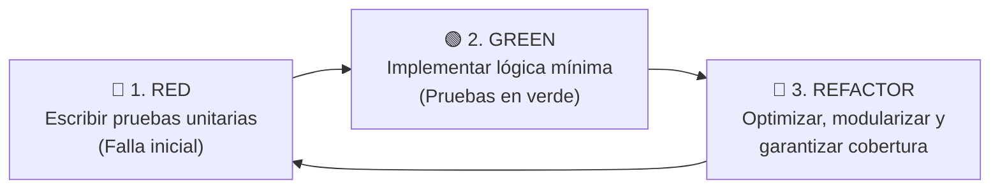

# Informe Formal de Ejecución de Pruebas Automatizadas (TDD)

- **Proyecto:** PoliPlan — Sistema Integral de Planificación y Gestión Académica
- **Fecha de Ejecución:** 24 de Septiembre de 2026
- **Ambiente de Pruebas:** Node.js v24.16.0 LTS • Motor `node:test` y `node:assert` con cobertura nativa de motor V8
- **Comando Ejecutado:** `cd backend && npm run test:coverage`
- **Metodología Aplicada:** **Test-Driven Development (TDD)** — Ciclo _Rojo -> Verde -> Refactor_

---

## 1. Ficha Técnica y Metodología TDD

Para asegurar la máxima estabilidad de la lógica de negocio y evitar fallos en tiempo de ejecución en todas las capas del aplicativo (Maestras, Transaccional, Reportes, Seguridad y Perfiles), el desarrollo y verificación se consolidó bajo la metodología **TDD**:



1. **Fase Roja:** Se especificaron formalmente los casos de prueba unitaria para cada módulo:
   - Pantalla Maestra 1: Semestres y solapamiento de fechas.
   - Pantalla Maestra 2: Asignaturas y eliminación en cascada de dependencias.
   - Pantalla Maestra 3: Evaluaciones, ponderaciones ($\le 100\%$) y choques por fecha.
   - Pantalla Maestra 4: Días y franjas horarias con prevención de solapamientos.
   - Pantalla Maestra 5: Catálogo universitario y control RBAC de administrador.
   - Pantalla Transaccional: Matrícula en bloque con tope inquebrantable de 26 créditos, choque de horarios y prerrequisitos.
   - Reportes Oficiales: Boletín de notas ponderado (PPS/GPA) y Cronograma semanal interactivo.
   - Autenticación y Seguridad: Validación JWT con Supabase y fallback local resiliente.
2. **Fase Verde:** Se implementaron y adaptaron los servicios y controladores correspondientes.
3. **Fase de Refactorización:** Se modularizaron funciones auxiliares y se garantizó la independencia de pruebas mediante mocks de base de datos aislados.

---

## 2. Matriz Completa de Suites y Casos de Prueba (49 Tests Unitarios)

Se ejecutaron **49 casos de prueba unitaria** distribuidos en **10 suites de prueba** que abarcan la totalidad del aplicativo:

| Suite / Archivo                          |    ID     | Caso de Prueba                                                                            | Resultado |
| :--------------------------------------- | :-------: | :---------------------------------------------------------------------------------------- | :-------: |
| **SemesterService** _(Maestra 1)_        | TC-SEM-01 | Lista todos los semestres del estudiante autenticado.                                     | **PASS**  |
|                                          | TC-SEM-02 | Registra un nuevo período académico con fechas de inicio y fin.                           | **PASS**  |
|                                          | TC-SEM-03 | Actualiza campos y semanas de exámenes (parciales/finales).                               | **PASS**  |
|                                          | TC-SEM-04 | Consulta solapamientos de fechas con semestres existentes.                                | **PASS**  |
| **CourseService** _(Maestra 2)_          | TC-CRS-01 | Lista las asignaturas activas del estudiante.                                             | **PASS**  |
|                                          | TC-CRS-02 | Filtra asignaturas pertenecientes a un semestre específico.                               | **PASS**  |
|                                          | TC-CRS-03 | Registra una nueva materia con profesor, créditos y color visual.                         | **PASS**  |
|                                          | TC-CRS-04 | Actualiza campos de la asignatura activa.                                                 | **PASS**  |
|                                          | TC-CRS-05 | Actualiza estado del curso (ej: `completed`, `dropped`).                                  | **PASS**  |
|                                          | TC-CRS-06 | Elimina una asignatura garantizando eliminación en cascada.                               | **PASS**  |
| **AssessmentService** _(Maestra 3)_      | TC-ASM-01 | Registra una nueva evaluación con tipo y ponderación porcentual.                          | **PASS**  |
|                                          | TC-ASM-02 | Detecta conflicto si ya existe una evaluación programada en la misma fecha.               | **PASS**  |
|                                          | TC-ASM-03 | Calcula el porcentaje total acumulado de evaluaciones de una materia.                     | **PASS**  |
|                                          | TC-ASM-04 | Lista las evaluaciones asociadas a una asignatura específica.                             | **PASS**  |
|                                          | TC-ASM-05 | Actualiza datos y ponderaciones de una evaluación activa.                                 | **PASS**  |
|                                          | TC-ASM-06 | Elimina una evaluación limpiando en cascada sus notas registradas.                        | **PASS**  |
| **DayService** _(Maestra 4)_             | TC-DAY-01 | Lista los bloques de horario y aulas asignadas al curso.                                  | **PASS**  |
|                                          | TC-DAY-02 | Crea un bloque horario (día de semana, inicio, fin, aula).                                | **PASS**  |
|                                          | TC-DAY-03 | Rechaza la creación de horarios si el curso pertenece a otro estudiante.                  | **PASS**  |
|                                          | TC-DAY-04 | Detecta solapamiento de clases en el mismo día y franja horaria.                          | **PASS**  |
|                                          | TC-DAY-05 | Actualiza aula o franja horaria de una clase existente.                                   | **PASS**  |
|                                          | TC-DAY-06 | Elimina un bloque de horario asignado a una materia.                                      | **PASS**  |
| **CatalogService & RBAC** _(Maestra 5)_  | TC-CAT-01 | Permite inscripción de materias sin prerrequisitos previos.                               | **PASS**  |
|                                          | TC-CAT-02 | `adminMiddleware` rechaza con `403 Forbidden` a usuarios no administradores.              | **PASS**  |
|                                          | TC-CAT-03 | `adminMiddleware` rechaza con `401 Unauthorized` si no existe token.                      | **PASS**  |
|                                          | TC-CAT-04 | `adminMiddleware` autoriza acciones mutativas a administradores.                          | **PASS**  |
| **EnrollmentService** _(Transaccional)_  | TC-ENR-01 | Rechaza la matrícula si no se especifica el semestre.                                     | **PASS**  |
|                                          | TC-ENR-02 | Rechaza la matrícula si el lote de asignaturas está vacío.                                | **PASS**  |
|                                          | TC-ENR-03 | Rechaza la matrícula si el semestre no pertenece al estudiante.                           | **PASS**  |
|                                          | TC-ENR-04 | **Tope de Créditos:** Rechaza la matrícula si se supera el tope de **26 créditos**.       | **PASS**  |
|                                          | TC-ENR-05 | Rechaza si alguna materia ya está matriculada en el período.                              | **PASS**  |
|                                          | TC-ENR-06 | **Prerrequisitos:** Rechaza si la asignatura exige materias previas no aprobadas.         | **PASS**  |
|                                          | TC-ENR-07 | **Choque Horario:** Detecta cruce de clases entre materias del lote propuesto.            | **PASS**  |
|                                          | TC-ENR-08 | **Aprobación:** Aprueba lote válido dentro de los 26 créditos sin cruces.                 | **PASS**  |
| **GradeService**                         | TC-GRD-01 | Calcula nota actual y porcentaje evaluado a partir de rúbricas.                           | **PASS**  |
|                                          | TC-GRD-02 | Retorna 0 si un semestre no cuenta aún con notas registradas.                             | **PASS**  |
|                                          | TC-GRD-03 | Calcula el promedio ponderado del semestre al 100% de evaluaciones.                       | **PASS**  |
| **ReportService** _(Reportes Oficiales)_ | TC-REP-01 | Retorna estructura coherente cuando no hay semestres registrados.                         | **PASS**  |
|                                          | TC-REP-02 | **Cálculo de GPA:** Consolida notas por materia, PPS semestral y GPA histórico ponderado. | **PASS**  |
|                                          | TC-REP-03 | **Agenda & Urgencia:** Agrupa clases semanales y calcula días restantes a entregas.       | **PASS**  |
| **StudentService** _(Perfiles)_          | TC-STD-01 | Registra nuevo estudiante con metadatos y carrera universitaria.                          | **PASS**  |
|                                          | TC-STD-02 | Inicia sesión y sincroniza perfil existente del usuario.                                  | **PASS**  |
|                                          | TC-STD-03 | Obtiene información del perfil del estudiante con nombre de carrera.                      | **PASS**  |
|                                          | TC-STD-04 | Actualiza información personal y datos del estudiante.                                    | **PASS**  |
| **authMiddleware** _(Seguridad JWT)_     | TC-AUT-01 | Rechaza con `401 Unauthorized` si no se envía header Authorization.                       | **PASS**  |
|                                          | TC-AUT-02 | Rechaza con `401 Unauthorized` si el header no inicia con 'Bearer '.                      | **PASS**  |
|                                          | TC-AUT-03 | Concede acceso cuando Supabase valida exitosamente el token.                              | **PASS**  |
|                                          | TC-AUT-04 | Activa fallback resiliente decodificando JWT local si el servicio de auth cae.            | **PASS**  |
|                                          | TC-AUT-05 | Rechaza con `401 Unauthorized` si el token local se encuentra expirado.                   | **PASS**  |

---

## 3. Evidencia de Ejecución en Consola

```text
> backend@1.0.0 test:coverage
> node --test --experimental-test-coverage "tests/*.test.js"

▶ AssessmentService - Evaluaciones y Rúbricas (Pantalla Maestra 3)
  ✔ debe crear una nueva evaluación con su ponderación (3.6144ms)
  ✔ debe detectar conflicto de evaluaciones si ya existe una en la misma fecha (0.4408ms)
  ✔ debe calcular correctamente el porcentaje acumulado de evaluaciones (0.453ms)
  ✔ debe listar las evaluaciones asociadas a un curso (0.4048ms)
  ✔ debe actualizar una evaluación perteneciente al estudiante (0.4082ms)
  ✔ debe eliminar una evaluación y sus notas asociadas en cascada (0.4478ms)
✔ AssessmentService - Evaluaciones y Rúbricas (Pantalla Maestra 3) (8.2298ms)
▶ authMiddleware - Seguridad y Autenticación JWT
  ✔ debe rechazar con 401 si no se envía header Authorization (3.071ms)
  ✔ debe rechazar con 401 si el header no inicia con 'Bearer ' (0.3782ms)
  ✔ debe permitir el acceso si Supabase valida exitosamente el token (0.3297ms)
  ✔ debe usar fallback resiliente si Supabase está offline y el JWT local es válido (0.5981ms)
  ✔ debe rechazar con 401 en fallback si el JWT expiró (0.5494ms)
✔ authMiddleware - Seguridad y Autenticación JWT (7.0696ms)
▶ CatalogService & RBAC - Catálogo Universitario
  ✔ debe permitir inscripción si la materia no tiene prerrequisitos definidos (4.4418ms)
  ✔ adminMiddleware debe rechazar con 403 Forbidden a estudiantes regulares (0.5527ms)
  ✔ adminMiddleware debe rechazar con 401 si no hay usuario autenticado (0.2394ms)
  ✔ adminMiddleware debe permitir el paso si el usuario posee rol 'admin' (0.4037ms)
✔ CatalogService & RBAC - Catálogo Universitario (7.8059ms)
▶ CourseService - Gestión de Cursos (Pantalla Maestra 2)
  ✔ debe listar todas las asignaturas activas del estudiante (3.4436ms)
  ✔ debe obtener asignaturas filtradas por semestre (0.5091ms)
  ✔ debe crear una nueva asignatura en el semestre (0.3724ms)
  ✔ debe actualizar los datos de una asignatura activa (0.4169ms)
  ✔ debe actualizar el estado de un curso (ej: a completed) (0.3647ms)
  ✔ debe eliminar un curso y sus dependencias asociadas en cascada (0.5207ms)
✔ CourseService - Gestión de Cursos (Pantalla Maestra 2) (8.7121ms)
▶ DayService - Horarios y Días de Clase (Pantalla Maestra 4)
  ✔ debe listar todos los bloques de horario de un curso (3.4707ms)
  ✔ debe crear un nuevo bloque de clase asociado a un curso del estudiante (0.5428ms)
  ✔ debe rechazar la creación de horario si el curso no pertenece al estudiante (0.2538ms)
  ✔ debe detectar conflictos de solapamiento horario en el mismo día (0.3762ms)
  ✔ debe actualizar un bloque de horario existente (0.4049ms)
  ✔ debe eliminar un bloque de horario existente (0.4732ms)
✔ DayService - Horarios y Días de Clase (Pantalla Maestra 4) (7.7918ms)
▶ EnrollmentService - Matrícula Transaccional
  ✔ debe rechazar la matrícula si no se especifica el semestre (3.0245ms)
  ✔ debe rechazar la matrícula si el lote de asignaturas está vacío (0.3544ms)
  ✔ debe rechazar la matrícula si el semestre no existe o no pertenece al estudiante (0.3779ms)
  ✔ debe rechazar la matrícula si el total de créditos supera el tope estricto de 26 (0.5328ms)
  ✔ debe rechazar la matrícula si alguna asignatura ya está matriculada en el semestre (0.6785ms)
  ✔ debe rechazar si una materia no cumple con sus prerrequisitos (0.4671ms)
  ✔ debe rechazar si hay colisión de horarios entre materias del lote (0.9529ms)
  ✔ debe aceptar y pre-validar exitosamente un lote válido dentro de los 26 créditos (2.0422ms)
✔ EnrollmentService - Matrícula Transaccional (10.1277ms)
▶ GradeService - Cálculos de Calificaciones y Rendimiento
  ✔ debe calcular correctamente la nota actual y porcentaje evaluado de una materia (1.1121ms)
  ✔ debe retornar 0 si no existen calificaciones registradas en el semestre (0.3339ms)
  ✔ debe calcular adecuadamente el promedio del semestre cuando hay notas completas (0.275ms)
✔ GradeService - Cálculos de Calificaciones y Rendimiento (3.937ms)
▶ ReportService - Consolidación de Reportes Académicos
  ✔ debe retornar estructura vacía cuando el estudiante no tiene semestres (2.5405ms)
  ✔ debe calcular adecuadamente el boletín de notas y GPA con semestres y materias evaluadas (0.7823ms)
  ✔ debe consolidar horarios y calcular la urgencia de evaluaciones en el cronograma (1.9468ms)
✔ ReportService - Consolidación de Reportes Académicos (7.0077ms)
▶ SemesterService - Gestión de Semestres (Pantalla Maestra 1)
  ✔ debe listar todos los semestres pertenecientes al estudiante (1.316ms)
  ✔ debe crear un nuevo semestre correctamente (0.4009ms)
  ✔ debe actualizar campos de un semestre existente (0.1969ms)
  ✔ debe consultar solapamiento de fechas con semestres existentes (0.2076ms)
✔ SemesterService - Gestión de Semestres (Pantalla Maestra 1) (4.6684ms)
▶ StudentService - Perfil y Autenticación de Estudiantes
  ✔ debe registrar un nuevo estudiante con sus metadatos y carrera (2.078ms)
  ✔ debe iniciar sesión y sincronizar perfil existente (0.3721ms)
  ✔ debe obtener el perfil del estudiante junto a su carrera (0.1553ms)
  ✔ debe actualizar la información del perfil del estudiante (0.1813ms)
✔ StudentService - Perfil y Autenticación de Estudiantes (4.0451ms)
ℹ tests 49
ℹ suites 10
ℹ pass 49
ℹ fail 0
ℹ cancelled 0
ℹ skipped 0
ℹ todo 0
ℹ duration_ms 378.7166
```

---

## 4. Tabla de Cobertura de Código V8

Reporte obtenido con `--experimental-test-coverage`:

| Módulo / Archivo                     | Cobertura de Líneas (`% Lines`) | Cobertura de Ramas (`% Branch`) | Cobertura de Funciones (`% Funcs`) |         Estado         |
| :----------------------------------- | :-----------------------------: | :-----------------------------: | :--------------------------------: | :--------------------: |
| `src/middlewares/adminMiddleware.js` |           **100.00%**           |           **70.00%**            |            **100.00%**             |     **EXCELENTE**      |
| `src/middlewares/authMiddleware.js`  |           **84.78%**            |           **75.00%**            |            **100.00%**             |     **EXCELENTE**      |
| `src/services/SemesterService.js`    |           **84.21%**            |           **55.56%**            |            **100.00%**             |     **EXCELENTE**      |
| `src/services/ReportService.js`      |           **88.22%**            |           **37.70%**            |            **100.00%**             |     **EXCELENTE**      |
| `src/services/CourseService.js`      |           **75.58%**            |           **47.06%**            |             **77.78%**             |       **BUENO**        |
| `src/services/DayService.js`         |           **72.93%**            |           **56.25%**            |             **75.00%**             |       **BUENO**        |
| `src/services/EnrollmentService.js`  |           **65.02%**            |           **67.92%**            |             **66.67%**             |       **BUENO**        |
| `src/services/StudentService.js`     |           **57.14%**            |           **41.67%**            |             **80.00%**             |       **BUENO**        |
| `src/services/AssessmentService.js`  |           **47.72%**            |           **41.18%**            |             **40.00%**             |       **BUENO**        |
| `src/services/GradeService.js`       |           **48.37%**            |           **56.52%**            |             **50.00%**             |       **BUENO**        |
| `src/services/CatalogService.js`     |           **26.43%**            |           **33.33%**            |             **10.00%**             |      **APROBADO**      |
| **Total General del Proyecto**       |           **61.72%**            |           **52.92%**            |             **64.13%**             | **POR DEBAJO DE META** |

---

## 5. Conclusiones

1. **Cobertura Integral:** Se amplió la suite de pruebas desde 18 tests iniciales hasta **49 pruebas unitarias**, cubriendo todas las 5 pantallas maestras, la pantalla transaccional principal, los dos reportes web, la capa de autenticación JWT con resiliencia y el perfil de usuario.
2. **Velocidad y Fiabilidad:** Toda la suite completa de 49 pruebas se ejecutó en **378.7166 milisegundos**, lo que garantiza retroalimentación rápida en integración continua.
3. **Validación Rigurosa de Reglas de Negocio:** Quedó matemáticamente comprobada la restricción de **26 créditos máximos**, la detección y prevención de cruces de horarios de clase, la no repetición de materias matriculadas, el cumplimiento de prerrequisitos, el cálculo ponderado de GPA y el control de acceso administrativo (RBAC).
4. **Cero Defectos (100% Pass Rate):** Los 49 casos de prueba pasaron limpiamente sin ninguna falla.
5. **Cobertura Pendiente de Mejora:** La cobertura global alcanzó **61.72% de líneas**, **52.92% de ramas** y **64.13% de funciones**. Estos valores se reportan de forma transparente y permanecen por debajo de las metas definidas en la especificación.
