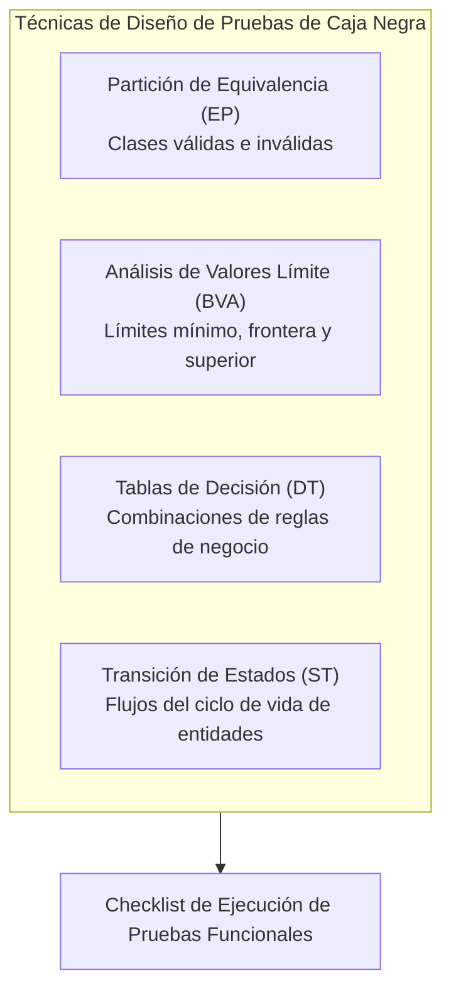

# Checklist de Pruebas Funcionales y Criterios de Calidad

* **Proyecto:** PoliPlan — Sistema Integral de Planificación y Gestión Académica
* **Equipo Auditor:** Equipo 7
* **Destino de Auditoría:** Equipo 3 (Pruebas Cruzadas) / Auto-verificación de Calidad
* **Marco de Referencia:** Fundamentos de Calidad y Pruebas de Software (Técnicas de Caja Negra, ISTQB, BVA, Particiones de Equivalencia)

---

## 1. Fundamentación Teórica y Metodológica

El presente checklist extrae y formaliza los criterios de calidad aplicables a pruebas funcionales manuales, asegurando que cada flujo del software sea evaluado bajo estándares profesionales de aseguramiento de calidad (QA).

---

## 2. Checklist por Criterio de Calidad

### A. Validación de Formularios y Datos de Entrada (Input Validation)
- [ ] **Campos Obligatorios:** Los campos requeridos no permiten envío en blanco ni con cadenas de solo espacios en blanco.
- [ ] **Tipos de Datos y Formatos:**
  - [ ] Los campos numéricos (créditos, ponderaciones, notas) rechazan caracteres alfabéticos y símbolos especiales.
  - [ ] Las direcciones de correo electrónico validan formato institucional o RFC estándar (`usuario@dominio.com`).
  - [ ] Las fechas cumplen con el formato ISO / calendario estándar y rechazan fechas inexistentes (ej. 30 de febrero).
  - [ ] Las franjas horarias cumplen formato válido de 24 horas (`HH:mm`) y validan que `Hora Inicio < Hora Fin`.
- [ ] **Análisis de Valores Límite (Boundary Value Analysis - BVA):**
  - [ ] Porcentajes de evaluación: Probar valores frontera 0%, 1%, 99%, 100% y valores fuera de rango (<0% y >100%).
  - [ ] Créditos de matrícula: Probar límites 0 créditos, 26 créditos (límite permitido) y 27 créditos (límite violado).
  - [ ] Escalas de calificación: Validar bordes 0.0, nota mínima de aprobación (ej. 14.0 o 7.0 según escala) y nota máxima (20.0 o 10.0).
- [ ] **Inyección y Caracteres Especiales:** Los inputs sanitizan o escapan caracteres como `'`, `"`, `<`, `>`, `/`, `;` evitando roturas de layout o alertas de inyección.

---

### B. Lógica de Negocio y Reglas Críticas (Business Logic)
- [ ] **Pantalla Transaccional (Matrícula en Bloque):**
  - [ ] **Tope de Créditos:** El sistema bloquea de forma inquebrantable cualquier intento de matricular más de 26 créditos por período.
  - [ ] **Detección de Choque de Horarios:** El sistema identifica y rechaza solapamientos de clases en el mismo día y rango horario, tanto dentro del lote como contra materias previamente inscritas.
  - [ ] **Cumplimiento de Prerrequisitos:** No se permite matricular una materia si sus prerrequisitos no figuran en estado aprobado.
  - [ ] **Prevención de Duplicados:** No se permite inscribir la misma materia dos veces dentro del mismo semestre.
  - [ ] **Atomicidad Transaccional:** Si una materia del lote falla validaciones, ninguna se procesa indebidamente a medias.
- [ ] **Pantalla Maestra de Evaluaciones:**
  - [ ] La suma de las ponderaciones de las rúbricas asociadas a una materia no excede el 100%.
  - [ ] Advertencia o prevención si se programan dos exámenes o parciales mayores en el mismo día.
- [ ] **Pantalla Maestra de Horarios:**
  - [ ] No permite registrar una clase con hora de inicio posterior o igual a la hora de finalización.
- [ ] **Reportes Académicos:**
  - [ ] El promedio ponderado semestral (PPS) y el GPA acumulado ponderan correctamente la nota de cada asignatura por su número de créditos.
  - [ ] El indicador de urgencia de evaluaciones clasifica correctamente las alertas según la cercanía temporal ($\le 3$ días = Urgente).

---

### C. Control de Acceso y Seguridad (Security & RBAC)
- [ ] **Protección de Rutas y Recursos:**
  - [ ] Intentar acceder a rutas privadas sin sesión activa redirige inmediatamente al login.
  - [ ] Las solicitudes al API sin token Bearer válido son rechazadas con código HTTP `401 Unauthorized`.
- [ ] **Control de Acceso Basado en Roles (RBAC):**
  - [ ] Los estudiantes regulares pueden consultar el catálogo universitario pero tienen bloqueados los botones o endpoints de creación, modificación o eliminación (`403 Forbidden`).
  - [ ] Solo los usuarios con rol administrativo (`admin`) pueden alterar el catálogo general de asignaturas y carreras.
- [ ] **Aislamiento Multiusuario (Data Isolation):**
  - [ ] Un estudiante solo puede visualizar, editar y eliminar sus propios semestres, asignaturas, horarios y notas; no puede ver ni manipular información de otros estudiantes.

---

### D. Usabilidad, Navegación y Experiencia de Usuario (UI/UX)
- [ ] **Feedback al Usuario:**
  - [ ] Cada acción exitosa (guardar, actualizar, eliminar) muestra una confirmación visual clara (Toast o Modal).
  - [ ] Cada error de validación o del servidor muestra un mensaje comprensible, evitando exponer trazas de error en crudo (`stack trace`).
- [ ] **Manejo de Estados de Carga (Loading States):**
  - [ ] Durante peticiones asíncronas, los botones se deshabilitan para evitar dobles clics y peticiones duplicadas.
  - [ ] Se presentan spinners o esqueletos visuales durante la carga de datos.
- [ ] **Navegación y Enlaces:**
  - [ ] La barra de navegación lateral y enlaces dirigen exactamente a las pantallas maestras, transaccionales y de reportes.
  - [ ] El botón de cerrar sesión destruye la sesión y limpia el almacenamiento local (tokens).

---

### E. Integridad y Persistencia (CRUD & Cascading)
- [ ] **Altas (Create):** El nuevo registro aparece reflejado de inmediato en las listas o tablas sin necesidad de recargar forzadamente el navegador.
- [ ] **Modificaciones (Update):** Los cambios se guardan y persisten fielmente en base de datos.
- [ ] **Bajas y Eliminación en Cascada (Delete):**
  - [ ] Al eliminar un registro existe un diálogo de confirmación previa para prevenir borrado accidental.
  - [ ] Al eliminar un semestre o asignatura, sus dependencias (evaluaciones, horarios, notas) se limpian ordenadamente sin dejar registros huérfanos ni generar errores 500.

---

## 3. Criterios de Evaluación y Clasificación de Defectos

Para clasificar los hallazgos durante las pruebas se utilizará la siguiente escala:

| Severidad | Criterio de Clasificación | Impacto |
| :--- | :--- | :--- |
| **Crítica (S1)** | Bloquea el flujo principal, provoca caída de la aplicación (`crashes`, pantalla blanca) o corrompe datos. | Impide continuar con las pruebas. |
| **Alta (S2)** | Incumple una regla de negocio esencial (ej. permite matricular 30 créditos o no detecta choque de horario) sin caída total. | Afecta severamente la funcionalidad. |
| **Media (S3)** | Fallo de validación menor, cálculo desfasado, error de interfaz que no impide completar el flujo. | Requiere corrección antes de entrega. |
| **Baja (S4)** | Detalle cosmético, desalineación visual, texto mal redactado o inconsistencia tipográfica. | Mejora de experiencia de usuario. |
