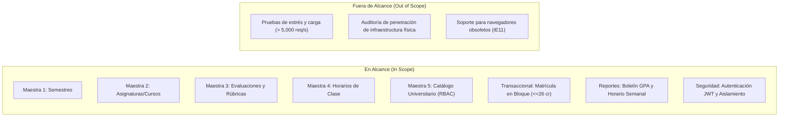
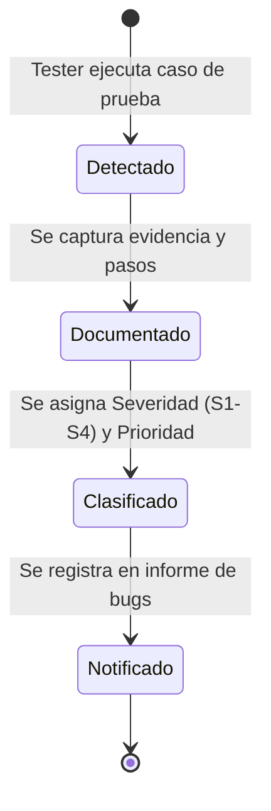

# Plan de Pruebas Funcionales Manuales (IEEE 829)

* **Documento:** Plan Maestro de Pruebas de Software (Test Plan)
* **Proyecto:** PoliPlan — Sistema Integral de Planificación y Gestión Académica
* **Versión:** 1.0.0
* **Equipo Evaluador:** Equipo 7
* **Aplicación Auditada:** Equipo 3 (Pruebas Cruzadas) & PoliPlan (Auto-verificación)
* **Fecha:** Septiembre 2026

---

## 1. Introducción y Propósito

El propósito de este documento es establecer la estrategia, alcance, recursos, cronograma y criterios de aceptación para la ejecución de las **Pruebas Funcionales Manuales**. 

El objetivo primordial es verificar que las 5 pantallas maestras, la pantalla transaccional de matrícula en bloque y los 2 reportes web oficiales cumplan estrictamente con las reglas del negocio académico, garantizando la integridad de datos, la seguridad y una experiencia de usuario robusta.

---

## 2. Alcance de las Pruebas (Test Scope)

### 2.1 Módulos dentro del Alcance:
1. **Autenticación y Seguridad:** Registro, login, protección de rutas y persistencia de sesión JWT.
2. **Pantalla Maestra 1 — Semestres:** Gestión del ciclo de vida de períodos académicos y semanas de exámenes.
3. **Pantalla Maestra 2 — Asignaturas:** CRUD de cursos activos, asignación de créditos, docentes y colores visuales.
4. **Pantalla Maestra 3 — Evaluaciones:** Configuración de rúbricas ponderadas, fechas de entrega y suma total de porcentajes.
5. **Pantalla Maestra 4 — Horarios:** Programación semanal de clases por aula y franja horaria con prevención de solapamientos.
6. **Pantalla Maestra 5 — Catálogo Universitario:** Consulta pública de materias/carreras y control de acceso RBAC administrativo.
7. **Pantalla Transaccional — Matrícula en Bloque:** Verificación de atomicidad, validación de prerrequisitos, chequeo de choques de horario y cumplimiento estricto del **tope máximo de 26 créditos**.
8. **Reportes Académicos:** Boletín oficial con GPA ponderado semestral/acumulado y cronograma con cálculo de urgencia.

---

## 3. Estrategia de Pruebas

Se aplicará un enfoque de **Caja Negra (Black-Box Testing)** complementado con técnicas formales:

1. **Pruebas de Humo (Smoke Testing):** Validación inicial rápida de despliegue y disponibilidad para verificar que el sitio carga y permite inicio de sesión.
2. **Pruebas Funcionales Positivas:** Verificación de que el sistema cumple el comportamiento esperado al ingresar datos válidos.
3. **Pruebas Funcionales Negativas:** Ingreso deliberado de datos erróneos, incompletos o fuera de norma para comprobar que el sistema bloquee la acción e informe adecuadamente al usuario.
4. **Análisis de Valores Límite (BVA):** Evaluación en los extremos operativos (ej. 25, 26 y 27 créditos de matrícula; 0%, 99% y 100% de ponderaciones).
5. **Pruebas de Integración y Cascada:** Validación de que la eliminación o modificación de una entidad padre (ej. curso) gestione adecuadamente sus dependencias (notas, horarios).

---

## 4. Criterios de Entrada y Salida (Entry & Exit Criteria)

### 4.1 Criterios de Entrada:
* La aplicación debe estar desplegada y accesible públicamente mediante URL HTTPS en la nube (Render).
* Base de datos provisionada con catálogos base (carreras y materias iniciales).
* Credenciales de prueba habilitadas (un usuario estudiante regular y un usuario con rol administrador).
* Documento de Historias de Usuario disponible para contrastar resultados esperados.

### 4.2 Criterios de Salida:
* 100% de los casos de prueba ejecutados y documentados.
* Cero defectos de severidad Crítica (S1) pendientes sin registrar.
* Registro de bugs documentado con pasos de reproducción, resultado obtenido vs esperado y evidencias visuales.
* Acta formal de ejecución de pruebas cruzadas completada.

---

## 5. Ambiente de Pruebas (Test Environment)

| Componente | Especificación del Ambiente |
| :--- | :--- |
| **Plataforma Cloud** | Render Cloud Application Hosting |
| **Frontend Web** | React 19 + Vite (HTTPS / SPA) |
| **Backend API** | Node.js Express REST API (HTTPS) |
| **Base de Datos** | Supabase Cloud (PostgreSQL 15+) |
| **Navegadores Auditados** | Google Chrome (v120+), Microsoft Edge (v120+), Mozilla Firefox (v120+) |
| **Resoluciones Evaluadas** | Desktop Full HD (1920x1080), Laptop (1366x768) y Tablet (768x1024) |

---

## 6. Roles y Responsabilidades en Pruebas Cruzadas

* **Equipo 7 (Evaluador):**
  * Diseñar la matriz de casos de prueba y sets de datos.
  * Ejecutar las pruebas sobre el sistema del **Equipo 3**.
  * Registrar hallazgos y evidencias en el formato estándar de defectos.
* **Equipo 3 (Auditado):**
  * Proveer URL pública y credenciales de acceso.
  * Recibir el informe de bugs para su correspondiente resolución o descargo.
* **Equipo 1 (Auditor de Equipo 7):**
  * Ejecutar pruebas sobre la aplicación desplegada de PoliPlan.

---

## 7. Procedimiento de Gestión de Defectos

Todo defecto detectado durante la ejecución seguirá el flujo:

