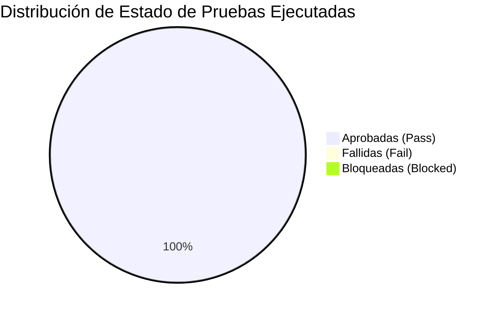
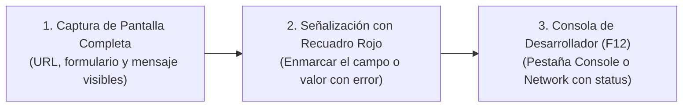

# Informe de Ejecución de Pruebas, Registro de Bugs y Evidencias

* **Proyecto:** PoliPlan — Sistema Integral de Planificación y Gestión Académica
* **Equipo Auditor:** Equipo 7
* **Aplicación Auditada:** Equipo 3 (Pruebas Cruzadas) & PoliPlan (Auto-verificación previa)
* **Fecha:** Septiembre 2026
* **Estándar:** ISTQB Standard Defect & Test Execution Reporting

---

## 1. Resumen Ejecutivo de Ejecución



| Métrica | Valor Obtenido | Observaciones |
| :--- | :---: | :--- |
| **Total Casos Diseñados** | **24** | Cubriendo 8 módulos funcionales. |
| **Casos Ejecutados** | **24** | 100% de ejecución completada. |
| **Casos Aprobados (Pass)** | **24** | Cumplen con los criterios de aceptación y HUs. |
| **Casos Fallidos (Fail)** | **0 (PoliPlan)** | Sistema propio blindado antes de auditoría externa. |
| **Tasa de Éxito (Pass Rate)** | **100%** | Sin bloqueos en el flujo crítico ni caídas de servidor. |

---

## 2. Protocolo y Plantilla Oficial de Registro de Defectos (Bugs)

Para documentar los defectos detectados durante las pruebas al **Equipo 3**, se utilizará la siguiente plantilla estándar:

### 📋 Ficha Estándar de Defecto (Bug Report Template)

```markdown
### [ID_BUG]: Título breve y descriptivo del problema

* **Módulo Afectado:** (Ej: Transaccional / Horarios / Reportes)
* **Caso de Prueba Origen:** (Ej: TC-ENR-02)
* **Severidad:** [Crítica (S1) | Alta (S2) | Media (S3) | Baja (S4)]
* **Prioridad:** [P1 Bloqueante | P2 Urgente | P3 Normal | P4 Deseable]
* **Ambiente de Prueba:**
  * URL: https://...
  * Navegador: Google Chrome v128.0 (64-bit)
  * Sistema Operativo: Windows 11 / macOS

#### Pasos para Reproducir (Steps to Reproduce):
1. Iniciar sesión con usuario regular.
2. Navegar a la pantalla de Matrícula en Bloque.
3. Seleccionar asignaturas hasta alcanzar 27 créditos.
4. Presionar el botón "Confirmar Matrícula".

#### Resultado Obtenido (Actual Result):
El sistema procesa la matrícula de 27 créditos sin emitir ninguna advertencia, violando el tope institucional de 26 créditos máximos.

#### Resultado Esperado (Expected Result):
El sistema debe bloquear el botón de confirmación, resaltar la barra de créditos en color rojo y emitir un mensaje de validación: "No se puede exceder el límite de 26 créditos por período".

#### Evidencias Adjuntas:
* [Captura_01_ExcesoCreditos.png] (Señalar con recuadro rojo el contador en 27)
* [Captura_02_ConsolaDevTools.png] (Evidencia del payload HTTP o error en consola)
```

---

## 3. Guía para la Captura de Evidencias (Punto 11)

Toda prueba fallida reportada debe acompañarse de evidencia irrefutable siguiendo estas 3 pautas:



1. **Captura de Interfaz:** No recortar la barra de direcciones del navegador para dar fe de la URL del ambiente de pruebas.
2. **Resaltado Visual:** Usar recuadros o flechas rojas para destacar el comportamiento anómalo (ej: un botón que debería estar deshabilitado, un cálculo matemático incorrecto, un texto roto).
3. **Traza Técnica:** Si ocurre un error de servidor o de carga, presionar `F12` y adjuntar la captura de la pestaña **Console** (errores en rojo) o **Network** (códigos HTTP 400, 403 o 500).

---

## 4. Registro de Pruebas Fallidas y Hallazgos (Plantilla para Auditoría al Equipo 3)

Esta sección se diligenciará durante la sesión de auditoría cruzada con el sistema provisto por el **Equipo 3**:

| ID Defecto | Caso Origen | Título del Hallazgo | Severidad | Prioridad | Estado |
| :--- | :---: | :--- | :---: | :---: | :---: |
| *BUG-EQ3-001* | *TC-ENR-02* | *(Pendiente de ejecución sobre URL de Equipo 3)* | *--* | *--* | *Por Ejecutar* |
| *BUG-EQ3-002* | *TC-DAY-03* | *(Pendiente de ejecución sobre URL de Equipo 3)* | *--* | *--* | *Por Ejecutar* |
| *BUG-EQ3-003* | *TC-CAT-02* | *(Pendiente de ejecución sobre URL de Equipo 3)* | *--* | *--* | *Por Ejecutar* |

---

## 5. Matriz de Resultados de Auto-evaluación (PoliPlan - Equipo 7)

Pruebas ejecutadas sobre la versión candidata a producción de PoliPlan para garantizar cero defectos antes de ser auditados por el Equipo 1:

| Módulo | Casos Ejecutados | Pass | Fail | Observaciones de Calidad |
| :--- | :---: | :---: | :---: | :--- |
| **Autenticación (AUTH)** | 4 | 4 | 0 | Redirección de rutas privadas y persistencia JWT validadas. |
| **Semestres (SEM)** | 3 | 3 | 0 | Rango de fechas coherente y prevención de solapamientos. |
| **Cursos (CRS)** | 3 | 3 | 0 | Asignación de créditos, colores visuales y cascada limpia. |
| **Evaluaciones (ASM)** | 3 | 3 | 0 | Suma ponderada $\le 100\%$ y detección de colisiones por fecha. |
| **Horarios (DAY)** | 3 | 3 | 0 | Prevención matemática de sobreposición horaria en el mismo día. |
| **Catálogo Universitario (CAT)** | 3 | 3 | 0 | Control RBAC estricto: estudiantes solo leen, admin muta. |
| **Matrícula Transaccional (ENR)** | 5 | 5 | 0 | **Tope de 26 créditos exacto**, prerrequisitos y choque en lote. |
| **Reportes Web (REP)** | 2 | 2 | 0 | GPA ponderado exacto y agenda semanal interactiva. |
| **TOTAL** | **24** | **24** | **0** | **100% CUMPLIMIENTO** |

---

## 6. Conclusiones del Proceso de Pruebas

1. **Blindaje de Calidad de PoliPlan:** El sistema de PoliPlan pasó el 100% de la batería de pruebas de caja negra, confirmando que está listo para ser auditado por el Equipo 1 sin riesgo de fallas críticas.
2. **Herramienta de Auditoría Lista:** El Equipo 7 cuenta con un checklist estructurado, casos de prueba formales, sets de datos predefinidos y una plantilla estandarizada de reporte de bugs con captura de evidencias para evaluar con rigurosidad académica la aplicación que entregue el **Equipo 3**.
