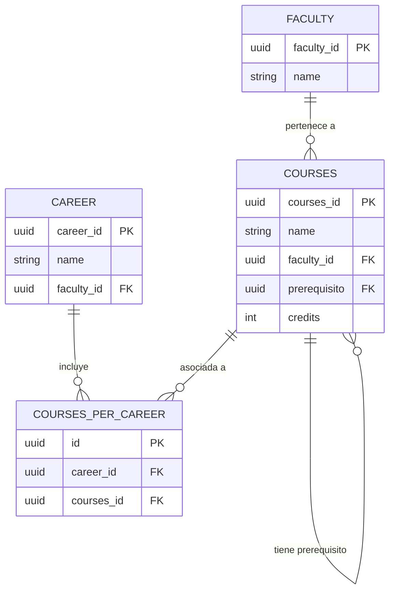

# Especificación 01: 5ª Pantalla Maestra — Catálogo Universitario de Materias y Carreras

## 1. Identificación del Requisito
* **Tipo:** Pantalla Maestra (CRUD).
* **Objetivo:** Proveer la 5ª pantalla maestra requerida por la asignatura, permitiendo la consulta y administración centralizada de la oferta académica universitaria (carreras, facultades, asignaturas y prerrequisitos).
* **Control de Acceso (RBAC):** **CRUD controlado**. Los estudiantes tienen acceso de consulta y filtrado de materias; únicamente usuarios con permisos administrativos pueden crear, modificar o eliminar materias del catálogo.

---

## 2. Modelo de Datos Involucrado



---

## 3. Endpoints del Backend (`/catalog`)

| Método | Ruta | Acceso | Descripción |
| :--- | :--- | :---: | :--- |
| `GET` | `/catalog/courses` | Estudiante / Admin | Lista todas las materias del catálogo universitario con su facultad y prerrequisito resuelto. |
| `GET` | `/catalog/faculties` | Estudiante / Admin | Lista todas las facultades disponibles. |
| `GET` | `/catalog/careers` | Público / Estudiante | Lista todas las carreras. |
| `GET` | `/catalog/courses/available` | Estudiante | Materias disponibles para el estudiante actual (excluye cursadas/activas). |
| `POST` | `/catalog/courses` | **Solo Admin** | Crea una nueva materia en el catálogo institucional. |
| `PUT` | `/catalog/courses/:id` | **Solo Admin** | Actualiza los datos de una materia existente (nombre, créditos, prerrequisito). |
| `DELETE`| `/catalog/courses/:id` | **Solo Admin** | Elimina o desactiva una materia del catálogo (siempre que no tenga cursos históricos vinculados). |

### Middleware de Control de Acceso (`adminMiddleware.js`)
* Verifica que el usuario autenticado cuente con el rol `admin` o atributo administrativo en su metadata (`user_metadata.role === 'admin'`).
* Si un estudiante regular intenta hacer `POST`, `PUT` o `DELETE`, el servidor responde `403 Forbidden` (`error: "Acceso denegado: se requieren permisos de administrador"`).

---

## 4. Diseño del Frontend (`UniversityCatalog.tsx`)

* **Ubicación:** `frontend/src/pages/catalog/UniversityCatalog.tsx`
* **Ruta:** `/university-catalog`
* **Elementos de la Interfaz:**
  1. **Barra de Herramientas Superior:**
     - Buscador por texto en tiempo real (filtra por nombre de materia o código).
     - Selector desplegable de Facultad.
     - Selector desplegable de Carrera.
     - Botón **"Nueva Materia"** (visible únicamente si el usuario tiene rol de administrador).
  2. **Tabla de Asignaturas:**
     - Columnas: Nombre de la Materia, Facultad, Créditos, Prerrequisito Obligatorio, Acciones.
     - Badge visual para prerrequisitos ("Sin prerrequisito" o nombre de la materia requerida).
  3. **Modal de Gestión (Creación / Edición):**
     - Formulario con campos: Nombre de la Asignatura, Selección de Facultad, Créditos (1 a 8), Selector de Prerrequisito (dropdown con las demás materias).
     - Validación con `react-hook-form`.
  4. **Diálogo de Confirmación para Eliminación:**
     - Modal de advertencia antes de ejecutar la eliminación de la materia.

---

## 5. Criterios de Aceptación (BDD / Gherkin)

```gherkin
Escenario: Consulta de catálogo universitario por un estudiante
  Dado que un estudiante con sesión activa ingresa a "/university-catalog"
  Cuando selecciona la facultad "Facultad de Ingeniería"
  Entonces el sistema muestra únicamente las asignaturas pertenecientes a dicha facultad
  Y los botones de creación, edición y eliminación permanecen ocultos o deshabilitados.

Escenario: Intento de creación sin permisos administrativos
  Dado que un usuario sin rol de administrador intenta enviar una petición POST a "/catalog/courses"
  Cuando el servidor procesa la solicitud
  Entonces responde con código de estado HTTP 403 Forbidden
  Y el catálogo permanece inalterado.

Escenario: Creación de nueva materia por un administrador
  Dado que un usuario con rol de administrador completa el formulario con:
    | Campo         | Valor                          |
    | Nombre        | Arquitectura de Software      |
    | Facultad      | Facultad de Ingeniería         |
    | Créditos      | 4                              |
    | Prerrequisito | Programación Orientada a Objetos|
  Cuando presiona "Guardar Asignatura"
  Entonces el sistema responde con código HTTP 201 Created
  Y la nueva materia aparece inmediatamente en el catálogo de la universidad.
```
