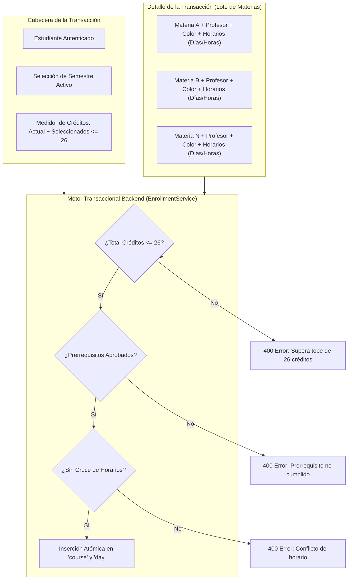

# Especificación 02: Pantalla Transaccional Principal — Matrícula Semestral en Bloque

## 1. Identificación del Requisito
* **Tipo:** Pantalla Transaccional Principal (Cabecera - Detalle).
* **Objetivo:** Cumplir con el requisito de una pantalla transaccional donde el estudiante planifica e inscribe en bloque su carga académica semestral, garantizando atomicidad y cumplimiento de reglas de negocio en una sola operación.
* **Tope Máximo de Créditos:** **26 créditos por período semestral**.

---

## 2. Arquitectura de la Transacción (Cabecera - Detalle)



---

## 3. Reglas de Negocio Estrictas

1. **Regla del Límite de Créditos (Máx 26):**
   $$\sum \text{Créditos Previamente Matriculados en Semestre} + \sum \text{Créditos Nuevos en el Lote} \le 26$$
   Si la suma excede 26 créditos, la transacción es rechazada inmediatamente con error descriptivo.
2. **Regla de Prerrequisitos:**
   Toda asignatura seleccionada que posea un `prerequisito` debe contar con un registro previo en la tabla `course` para ese estudiante con estado `status = 'completed'` y calificación aprobatoria ($\ge 3.0$).
3. **Regla de No Sobreposición Horaria (Días y Horas):**
   Ninguna de las asignaturas a matricular puede cruzar sus franjas horarias con otra asignatura del mismo lote, ni con asignaturas previamente matriculadas en el mismo semestre:
   $$\text{Solapamiento} \iff (\text{Día}_A = \text{Día}_B) \land (\text{Inicio}_A < \text{Fin}_B) \land (\text{Fin}_A > \text{Inicio}_B)$$
4. **Atomicidad:**
   La matrícula se realiza en bloque. Si una sola de las asignaturas falla cualquiera de las tres validaciones anteriores, ninguna se inserta en la base de datos (operación reversible y atómica).

---

## 4. Endpoints del Backend (`/enrollment`)

### `POST /enrollment/validate`
* **Propósito:** Pre-validar la selección en tiempo real sin guardar en la base de datos.
* **Payload de entrada:**
  ```json
  {
    "semester_id": "uuid-del-semestre",
    "courses": [
      {
        "courses_id": "uuid-materia-catalogo",
        "credits": 4,
        "days": [
          { "day_name": "Lunes", "start_time": "08:00", "end_time": "10:00" }
        ]
      }
    ]
  }
  ```
* **Respuesta (200 OK):**
  ```json
  {
    "valid": true,
    "totalCredits": 16,
    "creditsLimit": 26,
    "warnings": []
  }
  ```

### `POST /enrollment/process`
* **Propósito:** Ejecución atómica de la matrícula semestral.
* **Payload:** Igual al endpoint de pre-validación, agregando metadatos visuales (`teacher`, `color`).
* **Respuesta Exitosa (201 Created):**
  ```json
  {
    "message": "Matrícula procesada exitosamente",
    "enrolledCoursesCount": 4,
    "totalSemesterCredits": 16
  }
  ```

---

## 5. Diseño del Frontend (`Enrollment.tsx`)

* **Ubicación:** `frontend/src/pages/enrollment/Enrollment.tsx`
* **Ruta:** `/enrollment`
* **Estructura Visual:**
  1. **Sección Cabecera:**
     - Selector de Semestre Académico (obtenido vía `semesterViewRequest`).
     - Barra de progreso de créditos con indicador dinámico (ejemplo: `18 / 26 Créditos`). Cambia a color rojo de advertencia si la selección supera los 26 créditos.
     - Indicador de estado del semestre.
  2. **Sección Selector de Materias Disponibles:**
     - Desplegable de materias disponibles del catálogo (vía `availableCoursesRequest`), mostrando facultad y créditos.
     - Botón "Agregar al Bloque".
  3. **Sección Detalle (Lote de Asignaturas Seleccionadas):**
     - Lista/tarjetas de asignaturas en preparación.
     - Por cada asignatura:
       - Input de Docente.
       - Paleta de color selector.
       - Selector de horarios: Días (Lunes a Sábado), Hora Inicio, Hora Fin.
       - Botón "Quitar del bloque".
  4. **Panel Inferior de Confirmación:**
     - Resumen de créditos totales del lote.
     - Alertas de conflictos de horarios en tiempo real.
     - Botón principal **"Confirmar y Procesar Matrícula"** (bloqueado si el total de créditos $> 26$ o si hay conflictos).

---

## 6. Criterios de Aceptación (BDD / Gherkin)

```gherkin
Escenario: Intento de matrícula superando el tope de 26 créditos
  Dado que un estudiante selecciona un lote de asignaturas que suman 28 créditos
  Cuando intenta procesar la matrícula
  Entonces el sistema bloquea la acción
  Y muestra un mensaje de alerta: "El total de créditos (28) supera el límite máximo permitido de 26 créditos semestrales".

Escenario: Intento de matrícula con cruce de horario
  Dado que el estudiante agrega "Física I" los Martes de 08:00 a 10:00
  Y agrega "Cálculo Integral" los Martes de 09:00 a 11:00
  Cuando el sistema pre-valida el horario
  Entonces detecta un conflicto de horario entre ambas asignaturas
  Y resalta visualmente el solapamiento bloqueando el envío.

Escenario: Procesamiento exitoso de matrícula en bloque
  Dado que el estudiante selecciona 4 asignaturas con un total de 16 créditos
  Y todas cumplen sus prerrequisitos y no poseen cruces de horario
  Cuando presiona "Confirmar y Procesar Matrícula"
  Entonces el servidor inserta las 4 materias con sus respectivos horarios atómicamente
  Y redirige al estudiante al panel principal con mensaje de éxito.
```
