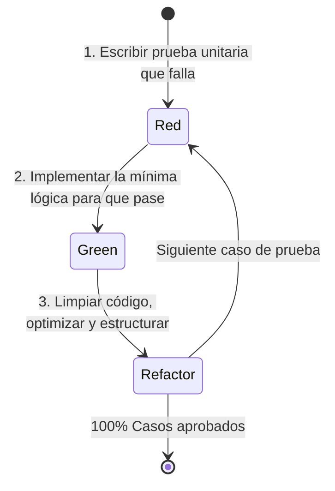

# Especificación 04: Suite de Pruebas Automatizadas TDD e Informe de Ejecución

## 1. Identificación del Requisito
* **Tipo:** Calidad de Software, Pruebas Automatizadas y Documentación Técnica.
* **Objetivo:** Cumplir con la aplicación rigurosa de pruebas unitarias bajo la metodología **TDD (Test-Driven Development)** y generar el **Informe de Ejecución de Pruebas** con evidencias de cobertura.
* **Framework Seleccionado:** **Vitest** (por su rapidez, compatibilidad nativa con TypeScript/ESM y reporte de cobertura integrado) + **Supertest** para pruebas de integración de endpoints.

---

## 2. Metodología TDD (Red - Green - Refactor)

Cada prueba unitaria se diseña y ejecuta respetando el ciclo estándar de TDD:



1. **Rojo (Red):** Se escribe la prueba con los casos de éxito y de borde antes de la lógica final. La prueba falla.
2. **Verde (Green):** Se escribe la implementación necesaria en el servicio para satisfacer las aserciones de la prueba.
3. **Refactorización (Refactor):** Se limpia el código, se extraen funciones auxiliares y se mejora la legibilidad asegurando que todos los tests sigan en verde.

---

## 3. Cobertura de Suites de Pruebas

### Suite 1: `EnrollmentService.test.js` (Lógica Transaccional)
* **Caso 1 (Tope de Créditos):** Debe rechazar una solicitud de matrícula si la sumatoria de créditos supera los **26 créditos**.
* **Caso 2 (Límite Válido):** Debe aceptar una solicitud cuando los créditos son exactamente 26 o inferiores ($\le 26$).
* **Caso 3 (Validación de Prerrequisitos):** Debe rechazar la inscripción de una asignatura si el estudiante no tiene registrada la materia previa con estado `completed` y calificación aprobatoria.
* **Caso 4 (Colisión de Horarios en el Lote):** Debe detectar si dos materias seleccionadas en la misma transacción coinciden en día y se sobreponen en sus horas de inicio y fin.
* **Caso 5 (Colisión con Materias Existentes):** Debe detectar cruce de horario con una materia previamente inscrita en el semestre.

### Suite 2: `GradeService.test.js` (Cálculo de Notas y GPA)
* **Caso 1:** Cálculo exacto de la nota ponderada de una materia a partir de rúbricas/evaluaciones porcentuales.
* **Caso 2:** Cálculo del Promedio Ponderado Semestral (PPS) ponderando cada nota por los créditos de la asignatura.
* **Caso 3:** Cálculo del GPA histórico acumulado en múltiples semestres con diferente cantidad de créditos.
* **Caso 4:** Determinación correcta del estado: Aprobada ($\ge 3.0$) y Reprobada ($< 3.0$).

### Suite 3: `CatalogService.test.js` (Catálogo y RBAC)
* **Caso 1:** Filtrado correcto de materias disponibles, excluyendo asignaturas que el estudiante ya tiene en estado `active` o `completed`.
* **Caso 2:** Resolución adecuada del nombre del prerrequisito asociado.
* **Caso 3:** Rechazo de peticiones de modificación (crear, editar, eliminar) si el solicitante no posee rol `admin`.

---

## 4. Comandos de Ejecución y Métricas Objetivo

* **Ejecutar pruebas unitarias:**
  ```bash
  cd backend
  npm test
  ```
* **Ejecutar con generación de cobertura:**
  ```bash
  cd backend
  npm run test:coverage
  ```
* **Metas de Cobertura:**
  * Cobertura de Sentencias (`Statements`): $\ge 80\%$
  * Cobertura de Ramas (`Branches`): $\ge 75\%$
  * Cobertura de Funciones (`Functions`): $\ge 85\%$
  * Cobertura de Líneas (`Lines`): $\ge 80\%$

---

## 5. Entregable: Informe de Ejecución de Pruebas TDD (`INFORME_EJECUCION_TDD.md`)

Se generará un documento formal en `docs/INFORME_EJECUCION_TDD.md` que incluirá:
1. **Ficha Técnica del Entorno de Pruebas:** Node.js, Vitest, Supabase Mocking.
2. **Matriz de Casos de Prueba:** Lista detallada de cada test con su propósito y resultado.
3. **Evidencia de Ejecución en Consola:** Salida textual formateada de la ejecución de Vitest.
4. **Tabla Resumen de Cobertura de Código:** Reporte porcentual de cobertura sobre los servicios de negocio.
