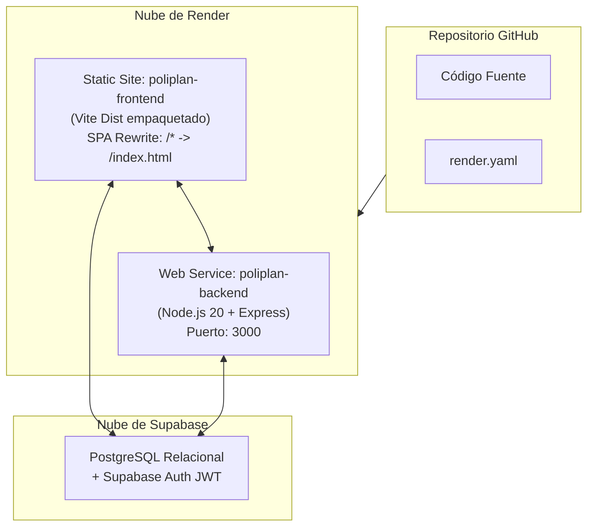

# Especificación 05: Despliegue en Servidor Web Público y Manuales Formales

## 1. Identificación del Requisito
* **Tipo:** Despliegue en Producción y Documentación del Sistema.
* **Objetivo:** Cumplir con los dos últimos criterios de la rúbrica:
  1. Aplicación publicada en un servidor web y públicamente accesible en Internet.
  2. Manual de Usuario, Manual de Instalación y Configuración, e Historias de Usuario con Criterios de Aceptación.

---

## 2. Arquitectura de Despliegue Público en Render

El despliegue se gestiona de forma reproducible mediante Infraestructura como Código con [render.yaml](file:///c:/Users/sebas/OneDrive/Desktop/ProyectoDeSW/render.yaml):

### Variables de Entorno de Producción
* **Backend (`poliplan-backend`):**
  * `PORT=3000`
  * `SUPABASE_URL`: URL del proyecto en Supabase.
  * `SUPABASE_KEY`: Service role key o anon key de producción.
  * `CLIENT_URL`: URL asignada por Render al frontend para la política de CORS.
* **Frontend (`poliplan-frontend`):**
  * `VITE_APP_SUPABASE_URL`: URL pública de Supabase.
  * `VITE_APP_SUPABASE_ANON_KEY`: Anon key pública de Supabase.
  * `VITE_API_BASE_URL`: URL pública del servicio de backend en Render.

---

## 3. Especificación de los Manuales Formales (`docs/`)

### 3.1 Manual de Usuario (`docs/MANUAL_DE_USUARIO.md`)
* **Público Objetivo:** Estudiantes universitarios y docentes evaluadores.
* **Contenido Obligatorio:**
  1. **Introducción y Objetivos:** Qué es PoliPlan y qué problemas resuelve.
  2. **Acceso al Sistema:** Proceso de registro de cuenta e inicio de sesión.
  3. **Navegación General:** Uso de la barra de navegación y menú desplegable.
  4. **Guía de las 5 Pantallas Maestras:**
     - Gestión de Semestres Académicos.
     - Gestión de Asignaturas Inscritas.
     - Gestión de Evaluaciones y Porcentajes.
     - Gestión de Horarios de Clase.
     - Consulta y Administración del Catálogo Universitario.
  5. **Guía de la Pantalla Transaccional:** Paso a paso para realizar una Matrícula Semestral en Bloque (respetando el límite de 26 créditos).
  6. **Guía de los 2 Reportes:** Cómo interpretar el Boletín de Calificaciones (GPA) y el Horario Semanal con Cronograma.

### 3.2 Manual de Instalación y Configuración (`docs/MANUAL_DE_INSTALACION_Y_CONFIGURACION.md`)
* **Público Objetivo:** Desarrolladores, administradores de sistemas y docentes.
* **Contenido Obligatorio:**
  1. **Requisitos Previos del Sistema:** Versiones de Node.js, gestores de paquetes (`pnpm`, `npm`), base de datos Supabase.
  2. **Instalación en Entorno Local:**
     - Clonado del repositorio.
     - Instalación de dependencias en backend y frontend.
     - Configuración de archivos `.env`.
     - Inicialización de servidores en modo desarrollo.
  3. **Configuración de la Base de Datos:** Scripts DDL y estructura relacional en PostgreSQL.
  4. **Guía de Despliegue en Producción:**
     - Despliegue paso a paso en Render mediante Blueprint (`render.yaml`).
     - Configuración de variables de entorno seguras.
     - Verificación del certificado SSL y conectividad pública.

### 3.3 Historias de Usuario con Criterios de Aceptación (`docs/HISTORIAS_DE_USUARIO_Y_CRITERIOS.md`)
* **Público Objetivo:** Equipo de desarrollo y aseguramiento de calidad (QA).
* **Contenido Obligatorio:**
  - Consolidación formal de las historias de usuario de Jira clasificadas por épicas (Autenticación, Catálogos Maestros, Transacción de Matrícula, Reportes y Auditoría).
  - Cada historia redactada en formato canónico:
    * *Como [rol] quiero [acción] para [beneficio]*
    * Criterios de aceptación detallados en formato **Given - When - Then** (Dado - Cuando - Entonces).
