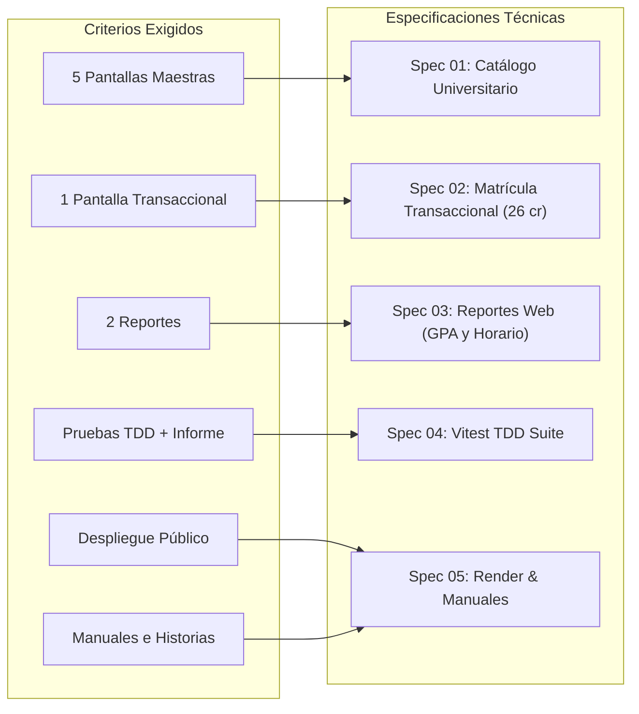

# 📐 Especificaciones Técnicas del Proyecto (Specs)

Este directorio contiene las especificaciones técnicas, arquitectónicas y funcionales para completar el 100% de los criterios exigidos para la entrega del proyecto de software.

---

## 📑 Índice de Especificaciones

| Archivo | Módulo / Requisito | Tipo de Pantalla / Componente | Criterio de la Materia |
| :--- | :--- | :---: | :--- |
| [01-catalogo-universitario.md](file:///c:/Users/sebas/OneDrive/Desktop/ProyectoDeSW/specs/01-catalogo-universitario.md) | **Catálogo Universitario de Materias y Carreras** | Pantalla Maestra (5ª) | Cumplir con las 5 pantallas maestras requeridas. Incluye RBAC (control de acceso administrativo). |
| [02-matricula-transaccional.md](file:///c:/Users/sebas/OneDrive/Desktop/ProyectoDeSW/specs/02-matricula-transaccional.md) | **Matrícula Semestral en Bloque** | Pantalla Transaccional Principal | Cumplir con la pantalla transaccional. Flujo Cabecera-Detalle, tope estricto de **26 créditos**, verificación de prerrequisitos y no solapamiento horario. |
| [03-reportes-academicos.md](file:///c:/Users/sebas/OneDrive/Desktop/ProyectoDeSW/specs/03-reportes-academicos.md) | **Boletín de Notas (GPA) y Horario Semanal** | Reportes Web (1 y 2) | Cumplir con los dos reportes del sistema con cálculos de rendimiento académico y cuadrícula horaria semanal. |
| [04-suite-tdd.md](file:///c:/Users/sebas/OneDrive/Desktop/ProyectoDeSW/specs/04-suite-tdd.md) | **Suite de Pruebas Automatizadas TDD** | Testing Backend & Cobertura | Cumplir con la aplicación de pruebas TDD e informe formal de ejecución con cobertura de código. |
| [05-despliegue-y-documentacion.md](file:///c:/Users/sebas/OneDrive/Desktop/ProyectoDeSW/specs/05-despliegue-y-documentacion.md) | **Despliegue en Render y Manuales** | Infraestructura & Docs | Cumplir con publicación en servidor web público accesible, manual de usuario, manual de instalación/configuración e historias de usuario. |

---

## 🎯 Matriz de Cobertura de Requisitos de la Rúbrica

---

## 🛠️ Convenciones de Implementación

1. **Lenguaje y Stack:** Frontend en **React 19 + TypeScript + Vite + Tailwind CSS**, Backend en **Node.js + Express**, Base de datos en **Supabase (PostgreSQL)**.
2. **Arquitectura Backend:** Patrón multicapa estricto: `Rutas -> Middlewares -> Controladores -> Servicios -> Base de Datos`.
3. **Manejo de Estado y Rutas Frontend:** `react-router`, `react-hook-form`, `axios` tipado y componentes modulares bajo `frontend/src/pages/` y `frontend/src/components/`.
4. **Metodología TDD:** Ciclo *Rojo -> Verde -> Refactor* en los servicios centrales de backend.
